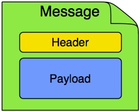

# 项目介绍

本项目是一个简单的消息发送服务，支持多种消息发送渠道，如短信、邮件、微信等。

项目代号：`hermes`，取自希腊神话中传递消息的神使。

## 基本概念

项目参考了 [Enterprise Integration Patterns（EIP）](https://en.wikipedia.org/wiki/Enterprise_Integration_Patterns#Messaging)
中的一些概念，将消息的发送抽象为一个消息通道（Message Channel）。
> 消息通道是一个抽象的概念，用于描述消息从一个发送者传递到一个或多个接收者的过程。它可以是一个队列、一个主题、一个流、一个管道等。

### Message (消息)

消息是实际传输数据的载体，它包含了发送者和接收者之间需要传递的信息。

#### Header (消息头)

消息头包含了消息的元数据，用于描述消息的属性，如消息的类型、发送者、接收者等。

实现方可以通过Header来自定义消息的属性，用于扩展消息的功能。

基础的消息头包含以下属性：

* requestId：消息的唯一标识
* timestamp：消息的时间戳
* channel：消息发送的通道标识

#### Payload (消息体)

消息体包含了消息的实际内容，是发送者和接收者之间需要传递的信息。

它被定义成一个any类型，由具体的实现方来约束消息的类型和格式。

### Message Channel（消息通道）

消息通道是消息的传输载体，它负责消息的发送。
消息通道可以是一个队列、一个主题、一个流、一个管道等。

